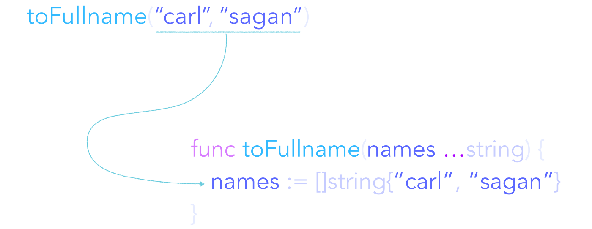
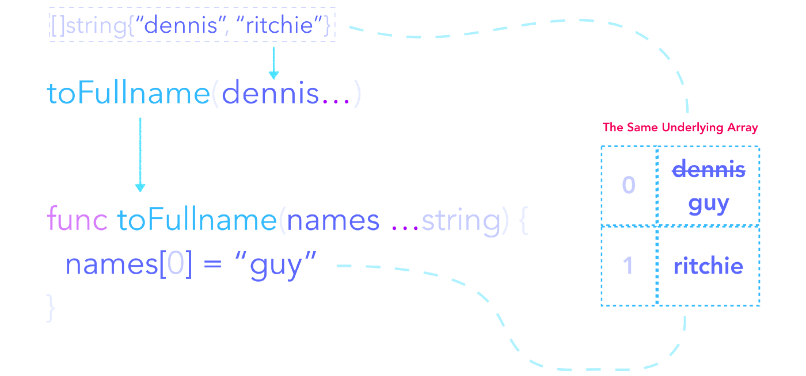

> 转过来方便日后细品
>
> 转自 https://studygolang.com/articles/11965
>
> 原英文 https://blog.learngoprogramming.com/golang-variadic-funcs-how-to-patterns-369408f19085


### 什么是可变参数函数？

可变参数函数即其参数数量是可变的 —— 0 个或多个。声明可变参数函数的方式是在其参数类型前带上省略符（三个点）前缀。

> 译者注：“可变参数函数”在一些翻译中也称“变长函数”，本篇译文中采用“可变参数函数“

该语句声明了一个可变参数函数及其以 “names” 命名的字符串类型可变参数

------

#### ✪ 一个简单可变参数函数

这个函数返回经过空格连接以后的参数形成的字符串。

```go
func toFullname(names ...stirng) string {
  return strings.Join(names, " ")
}
```

#### ✪ 你可以不传或传入更多的参数

```go
toFullname("carl", "sagan")

// output: "carl sagan"

toFullname("carl")

// output: "carl"

toFullname()

// output: ""
```

[在线运行代码](https://play.golang.org/p/qqnQkBvQBP)

------

#### 可变参数的使用场景

- 避免创建仅作传入参数用的临时切片
- 当参数数量未知
- 传达你希望增加可读性的意图

#### 示例

从 Go 语言标准库中的 `fmt.Println` 函数来理解其易用性的实现。

它通过可变参数函数来接收非固定数量的参数。

```go
func Prinln(a ...interface{})
```

如果不使用可变参数函数，其签名将会是如下形式：

```go
func Println(params []interface{})
```

你便需要传入一个切片来使用它——这确实显得有些累赘：

```go
fmt.Println([]interface{}{"hello", "world"})
```

而它原本的使用方式是简明愉快的：

```go
fmt.Println("hello", "world")
fmt.Println("hello")
fmt.Println()
```

> 之后，我们将更详细的讨论可变参数函数及演示一些常见的实际使用方式和场景

### ✪ 切片和可变参数函数

可变参数函数会在其内部创建一个”新的切片”。事实上，可变参数是一个简化了切片类型参数传入的[*语法糖*](https://en.wikipedia.org/wiki/Syntactic_sugar)。


[在线运行代码](https://play.golang.org/p/bBaWFVBsWT)

------

#### 不传参数

当你不传入参数的时候，可变参数会成为一个空值切片（ `nil` )。


所有的非空切片都有内建的数组，而空值切片则没有。

```go
func toFullname(names ...string) []string {
  return names
}

// names's underlying array: nil
```

然而，当你向空值切片添加元素时，它会自动内建一个包含该元素的数组。这个切片也就再也不是一个空值切片了。

Go 语言的内置函数 “`append`” 用于向一个已有的切片追加元素，并返回更新后的切片。

`append` 本身也是一个可变参数函数：

```go
func toFullname(names ...string) []string {
  return append(names, "hey", "what's up?")
}

toFullname()

// output: [hey what's up?]
```

[在线运行代码](https://play.golang.org/p/0RRDuGQWs_)

------

#### 传入已有的切片

你可以通过向一个已有的切片添加可变参数运算符 ”…“ 后缀的方式将其传入可变参数函数。

```go
names := []string{"carl", "sagan"}

toFullname(names...)

// output: "carl sagan"
```

这就好比通常的传参方式：

```go
toFullname("carl", "sagan")
```

**不过，这里还是有一点差异：**函数会在内部直接使用这个传入的切片，并不会创建一个的新的。更多详见下方。


你也可以像下面这样将数组转化成切片后传入可变参数函数：

```go
names := [2]string{"carl", "sagan"}

toFullname(names[:]...)
```

------

### 一些切片传入后的特异表现

假设你传入了一个已有的切片到某可变参数函数：

```go
dennis := []string{"dennis", "ritchie"}

toFullname(dennis...)
```

假设这个函数在内部改变了可变参数的第一个元素，譬如这样：

```go
func toFullname(names ...string) string {
  names[0] = "guy"
  return strings.Join(names, " ")
}
```

而这个修改会影响到源切片，”dennis“ 现在的值是：

```go
[]string{"guy", "ritchie"}
```

而非最初：

```go
[]string{"dennis", "ritchie"}
```

这是因为，传入的切片和函数内部使用的切片共享同一个底层数组，因此在函数内部改变这个数组的值同样会影响到传入的切片：



如果你直接传入参数（不使用切片），自然就不会产生这个现象了。

[在线运行代码](https://play.golang.org/p/_-kaUnLlT0)

------

#### 多切片动态传入

假设我们想在传参的同时在切片前端加上 “mr.”，然后再被函数使用。

```go
names := []string{"carl", "sagan"}
```

于是我们先将这个切片展开，并通过 `append` 函数追加到 `[]string{"mr.")`，然后将扩展后的切片展开供 `toFullname` 可变参数函数使用：

```go
toFullname(append([]string{"mr."}, names...)...)

// output: "mr. carl sagan"
```

这与以下代码效果相同：

```go
names = append([]string{"mr."}, "carl", "sagan")

toFullname(names...)

// 或是这样：

toFullname([]string{"mr.", "carl", "sagan"}...)

// 以及这样——不传入已有切片：

toFullname("mr.", "carl", "sagan")
```

[在线运行代码](https://play.golang.org/p/iTtz0SG_m5)

------

#### 返回传入的切片

返回值的类型不可以是可变参数的形式，但你可以将它作为一个切片返回：

```go
func f(nums ...int) []int {
  nums[i] = 10
  return nums
}
```

当你向 `f` 函数传入一个切片，它将返回一个新的切片。而传入的切片和返回的切片便产生了关联。对它们其中的的任何一方进行的所有操作都会影响到另一方（如前文所述）。

```go
nums  := []int{23, 45, 67}
nums2 := f(nums...)
```

这里，`nums` 和 `nums2` 拥有相同的元素。因为它们指向同一个底层数组。

```go
nums  = []int{10, 45, 67}
nums2 = []int{10, 45, 67}
```

[在线运行代码](https://play.golang.org/p/Jun14DYWvq) ? 包含对底层数组的详细阐述

------

#### 扩展操作符的反例

如果你的某些函数只期望接收数量可变的参数，那么请使用可变参数函数而不是声明一个接收切片的普通函数。

```go
// 反例
toFullname([]string{"rob", "pike"}...)

// 正例
toFullname("rob", "pike")
```

[在线运行代码](https://play.golang.org/p/oKQjwotLC_)

------

#### 使用可变参数的长度

你可以通过使用可变参数的长度来调整函数的行为。

```go
func ToIP(parts ...byte) string {
  parts = append(parts, make([]byte, 4-len(parts))...)
  return fmt.Sprintf("%d.%d.%d.%d", 
    parts[0], parts[1], parts[2], parts[3])
}
```

`ToIP` 函数接收可变参数 `parts`，然后根据 `parts` 的长度返回一个字符串类型的 IP 地址，并且具有缺省值 —— 0。

```go
ToIP(255) // 255.0.0.0
ToIP(10, 1) // 10.1.0.0
ToIP(127, 0, 0, 1) //127.0.0.1
```

[在线运行代码](https://play.golang.org/p/j9RcLvbs3K)

------

### ✪ 可变参数函数的函数签名

虽然可变参数函数只是一种语法糖，但由它的函数签名——[函数类型推断（ type identity ）](https://golang.org/ref/spec#Type_identity)—— 与以切片作为参数的普通函数并不相同。

举个例子，`[]string` 和 `…string` 有什么区别呢？

#### 可变参数函数的签名：

```go
func PrintVariadic(msgs ...string)

// signature: func(...string)
```

#### 以切片作为参数的普通函数签名：

```go
func PrintSlice(msgs []string)

// signature: func([]string)
```

事实上，它们的函数类型是不同的。我们试着将它们赋值给变量来作比较：

```go
variadic := PrintVariadic

// variadic is a func(...string)

slicey := PrintSlice

// slice is a func([]string)
```

因此，这两者相互间并不具备可替代性

```go
slicey = variadic

// error: type mismatch
```

[在线运行代码](https://play.golang.org/p/fsZYGgTyvF)

------

### ✪ 混合使用可变参数及非可变参数

你可以通过将非可变参数置于可变参数前面的方式来混合使用它们

```go
func toFullname(id int, names ...string) string {
  return fmt.Sprintf("#%02d: %s", id, strings.Join(names, " "))
}

toFullname(1, "carl", "sagan")

// output: "#01: carl sagan"
```

然而，你不能在可变参数之后再声明参数：

```go
func toFullname(id int, names ...string, age int) string {}

// error
```

[在线运行代码](https://play.golang.org/p/TlbDYapOCD)

#### 接受多类型参数

举例来说，Go 语言标准库中的 `Printf` 可变参数函数可以接受任何类型的参数，其实现是通过将类型声明为一个空的接口类型（ interface type ）。如此你便可以使用空接口类型让你的函数接受类型和数量都不确定的参数。

```go
func Printf(format string, a ...interface{}) (n int, err error) {
  /* 这是一个带着 a... 的传递操作 */

  return Fprintf(os.Stdout, format, a...)
}

fmt.Printf("%d %s %f", 1, "string", 3.14)

// output: "1 string 3.14"
```

#### 为什么 Printf 不只接收一个可变参数呢？

当你看到 `Printf` 的函数签名时，你会发现它接收一个叫 format 的字符串参数和一个可变参数。

```go
func Printf(format string , a ...interface{})
```

**这是因为 format 是一个必要的参数**。`Printf` 强制要求提供这个参数，否则会编译失败。

如果它将所有参数都通过一个可变参数来获取，那么可能导致调用者可能并没有提供必要的 format 参数，其可读性也不如一目了然的传参方式。这种签名清晰地告知了 `Printf` 所需要的一切。

同时，当调用者没有传入 a 参数的时候，其函数内部会避免创建一个不必要的切片 —— 而是向我们之前看到的一样，传入一个空值切片（ nil ）。这样可能对 `Printf` 来说并没有太多益处，但这对你的代码可以非常有用。

你也能将这个规则实践于你的代码。

#### 小心空接口类型

`interface{}` 同时被叫做*空接口类型*，意义在于其语义本身能绕过 Go 语言的静态类型检查。但在不必要的情况下使用它会使你得不偿失。

譬如，它可能强制让你使用[*反射*](https://blog.golang.org/laws-of-reflection)，而这是一个运行时特性（而非安全且快速度的编译时）。你可能需要自行检查类型错误，而不是让编译器来为你寻找他们。

> *使用空接口前务必三思。基于清晰的类型或接口之上来实现你所需的函数行为会更好。*

#### 通过空接口的方式向可变参数传递切片

你不能通过空接口类型向可变参数传递一个普通的切片。[为什么？详见此处](https://golang.org/doc/faq#convert_slice_of_interface)。

```go
hellos := []string{"hi", "hello", "merhaba"}
```

以下代码并不能像期望的那样跑起来：

```go
fmt.Printf(hellos...)
```

这是因为，hellos 是一个字符串切片，并不是一个空接口类型。一个可变参数或者一个切片都只能从属于某个类型。

因此，你需要先将 `hellos` 切片转换成空接口切片：

```go
var ihellos []interface = make([]interface{}, len(hellos))

for i, hello := range hellos {
  ihellos[i] = hello
}
```

现在这个表达式便可以工作了：

```go
fmt.Printf(ihellos...)

// output: [hi hello merhaba]
```

[在线运行代码](https://play.golang.org/p/8uRHsHFKSx)

------

### ✪ 对于函数式编程的实现

你可以声明一个接受数量可变的函数的可变参数函数。我们试着创建一个 formatter 函数类型。formatter 函数接受并返回一个字符串：

```go
type formatter func(s string) string
```

在声明一个可变参数函数，接受一个字符串和可变数量的 formatter 类型函数，管道式的处理这个字符串，并返回处理后的结果。

```go
func format(s string, fmtrs ...formatter) string {
  for _, fmtr := range fmtrs {
    s = fmtr(s)
  }

  return s
}

format(" alan turing ", trim, last, strings.ToUpper)

// output: TURING
```

[在线运行代码](https://play.golang.org/p/kCOP6_5h-t) 在线源码包含以上代码的运行原理。

当然，你也可以使用 channel、struct 等方式实现，而非函数式的链式调用规则。在[这里](https://golang.org/pkg/io/#MultiReader)和[这里](https://golang.org/src/text/template/parse/parse.go?s=1642:1753#L41)查看示例。

------

使用切片类型的函数返回值作为可变参数。

我们重用上面的 “format func” 来创建一个可重用的格式化管道构建器：

```go
func build(f string) []formatter {
  switch f {
  case "lastUpper":
    return []formatter{trim, last, strings.ToUpper}
  case "trimUpper":
    return []formatter{trim, strings.ToUpper}
    //...
  default:
    return identityFormatter
  }
}
```

然后使用扩展标识符将它的返回值传入 format 函数：

```go
format(" alan string ", build("lastUpper")...)

// output: TURING
```

[在线运行代码](https://play.golang.org/p/0peZRSOVWh) 包含以上代码片段的详细实现

------

#### 可变配置模式

你也许在其他面向对象编程语言中已经熟悉此设计模式，而它于 2014 年在 Go 语言中被 [Rob Pike](https://commandcenter.blogspot.com.tr/2014/01/self-referential-functions-and-design.html) 再次推广。它与[访问者模式](https://en.wikipedia.org/wiki/Visitor_pattern)有些相似。

该示例也许有些超前。有任何不清楚的地方可以提问。

我们创建一个 Logger，它的 verbosity 和 prefix 设置可以通过该配置模式实现在运行时被改变：

```go
type Logger struct {
  verbosity
  prefix string
}
```

SetOptions 通过可变参数为 Logger 提供一些设置来改变它的行为：

```go
func (lo *Logger) SetOptions(opts ...option) {
  for _, applyOptTo := range opts {
    applyOptTo(lo)
  }
}
```

我们创建一些返回配置方法的函数，它们在一个闭包中改变 Logger 的操作行为：

```go
func HighVerbosity() option {
  return func(lo *Logger) {
    lo.verbosity = High
  }
}

func Prefix(s string) option {
  return func(lo *Logger) {
    lo.prefix = s
  }
}
```

现在，我们基于默认配置声明一个新的 Logger：

```go
logger := &Logger{}
```

然后通过上面的可变参数函数提供一些设置：

```go
logger.SetOptions(
  HighVerbosity(),
  Prefix("ZOMBIE CONTROL"),
)
```

检查输出：

```go
logger.Critical("zombie outbreak!")

// [ZOMBIE CONTROL] CRITICAL: zombie outbreak！

logger.Info("1 second passed")

// [ZOMBIE CONTROL] INFO: 1 second passed
```

[在线运行代码](https://play.golang.org/p/X2XHSdYgdq) 包含以上代码片段的详细实现

------

### ✪ 无穷无尽的精神食粮！

- 在 Go 2 中，有一些改变可变参数函数表现的计划，看[这里](https://github.com/golang/go/issues/15209)，[这里](https://github.com/golang/go/issues/18605)，还有[这里](https://github.com/golang/go/issues/19218)。
- 你可以在 Go 语言标准文档里找到更正式的可变参数函数指南，看[这里](https://golang.org/ref/spec#Passing_arguments_to_..._parameters)，[这里](https://golang.org/ref/spec#Appending_and_copying_slices)，[这里](https://golang.org/ref/spec#Appending_and_copying_slices)，还有[这里](https://golang.org/ref/spec#Type_identity)。
- [通过 C 语言使用可变参数函数](https://sunzenshen.github.io/tutorials/2015/05/09/cgotchas-intro.html)
- 你能在[这里](https://rosettacode.org/wiki/Variadic_function)看找到多种语言的可变参数函数声明。尽情享用吧！

我们下个教程见！